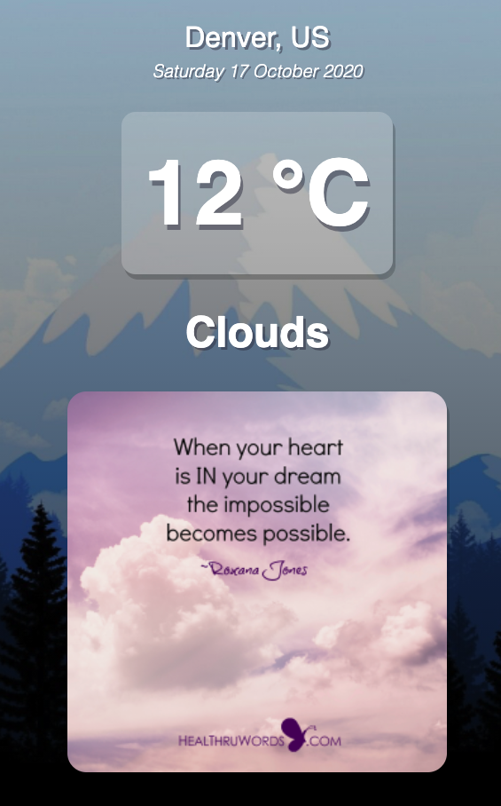
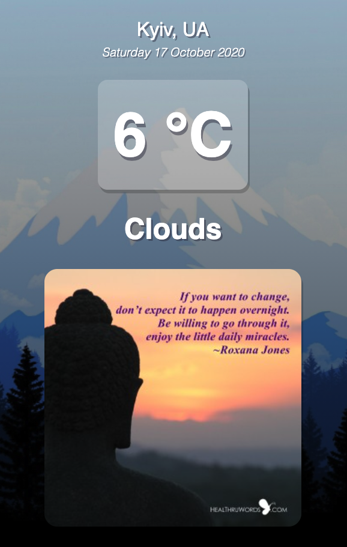

# A Weather App and Universal Inspirational Quotes in React JS
React makes it painless to create interactive UIs. Design simple views for each state in your application, and React will efficiently update and render just the right components when your data changes.

1. Learn how to make a Weather app in React JS, we use the Open Weather Map API to make calls to a restful api to return the current weather data. This uses the Modern Javascript Fetch AP along with React hooks.

2. Credit the source: The Exclusive HealThruWords Inspirational Quotes now available through API. Following its worldwide success, HealThruWords.com now offer its healing inspirational quotes and healing images via API. See https://healthruwords.com/inspirational-pictures/ for examples.

3. Deploying a React at (https://city-weather-healing-quotes-reactjs.netlify.app/)

